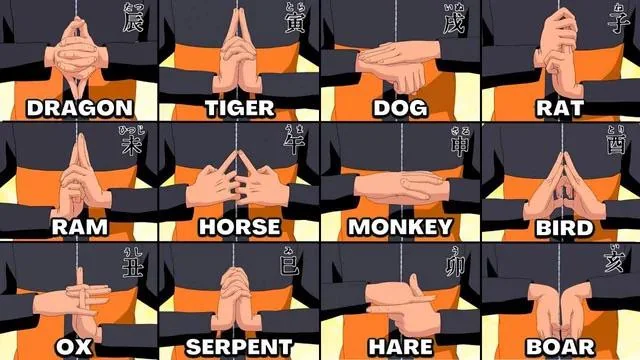

# Naruto Jutsu — Real-Time Hand Sign Detection

> Perform Naruto hand seals in front of your webcam. Watch jutsu animations erupt.

---

## What Is Naruto?

**Naruto** (ナルート) is one of the most influential manga and anime series ever created, written and illustrated by Masashi Kishimoto. Serialised from 1999–2014 in *Weekly Shōnen Jump*, it follows Naruto Uzumaki — a young ninja from the Hidden Leaf Village who carries a sealed nine-tailed demon fox inside him — on his journey to become the greatest ninja in the world, the **Hokage**.

The series is built on a deep, internally consistent power system: **chakra** (チャクラ), a life energy that flows through the body combining physical and spiritual energy. Ninjas (shinobi) manipulate chakra to perform superhuman techniques called **jutsu** (術).

---

## What Are Jutsu?

**Jutsu** are the supernatural techniques that define combat and daily life in the Naruto world. They range from the mundane (cloning, transformation, basic reinforcement) to the catastrophic (summoning natural disasters, reshaping reality).

There are three broad categories:

| Category | Kanji | Description |
|---|---|---|
| **Ninjutsu** | 忍術 | The core offensive/defensive techniques — elemental attacks, body manipulation, summonings |
| **Taijutsu** | 体術 | Pure physical combat — no chakra release required |
| **Genjutsu** | 幻術 | Illusion techniques that trap opponents in false realities |

Most powerful ninjutsu require the user to first **mould chakra** by weaving a precise sequence of **hand signs (印, in)**. Get a single sign wrong, perform them out of order, or break the sequence — and the technique fails. This is why mastering hand signs is the foundation of becoming a competent shinobi.

---

## What Are Hand Signs?

**Hand signs** (also called *hand seals*) are finger and palm configurations formed rapidly in sequence before releasing a jutsu. They act as a physical interface for chakra — each sign routes chakra through a different pathway in the body, building up the specific energy pattern the technique requires.

The 12 foundational signs are drawn from the **Chinese Zodiac** (十二支, *Jūnishi*), each named after one of its animals:



| Class ID | Japanese Name | English Animal | Romaji | Appears In |
|---|---|---|---|---|
| 0 | 子 | Rat | Ne | Fire Release, Water Release |
| 1 | 丑 | Ox | Ushi | Water Release, Wind Release |
| 2 | 寅 | Tiger | Tora | Fire Release, Earth Release |
| 3 | 卯 | Hare | U | Lightning Release, Earth Release |
| 4 | 辰 | Dragon | Tatsu | Fire, Water, Lightning, Earth |
| 5 | 巳 | Snake / Serpent | Mi | All 5 elements; Orochimaru's signature |
| 6 | 午 | Horse | Uma | Fire Release |
| 7 | 未 | Ram | Hitsuji | Earth Release, Lightning Release |
| 8 | 申 | Monkey | Saru | Fire Release, Water Release |
| 9 | 酉 | Bird | Tori | Lightning Release |
| 10 | 戌 | Dog | Inu | Water Release, Earth Release |
| 11 | 亥 | Boar | I | Earth Release |
| 12 | — | Shadow Clone | Kage Bunshin | One-handed or crossed-fingers variant |
| 13 | — | Neutral / None | — | Resting / transition state |

Master ninja like Naruto's teacher **Kakashi Hatake** can perform signs at speeds invisible to the human eye. The protagonist Naruto himself is famous for the **Shadow Clone Jutsu** (影分身の術, *Kage Bunshin no Jutsu*) — an A-rank forbidden technique that creates hundreds of physical clones — which requires only a single crossed-finger sign. The **Fireball Jutsu** (火遁・豪火球の術, *Katon: Gōkakyu no Jutsu*), the hallmark technique of the Uchiha clan, chains **Snake → Ram → Monkey → Boar → Horse → Tiger**.

---

## The Project

This is a portfolio Computer Vision project that brings hand sign detection into the real world: **train a neural network on your own hands, then perform jutsu in front of your webcam and watch the animations fire**.

The experience is deliberately authentic to the source material — you actually hold the hand seal, wait for confirmation, and trigger the effect. No shortcuts.

### Features

- **In-browser training** — collect samples, train a 14-class neural network, and export the model, all inside the browser with no server required
- **Real-time inference** — 30fps MediaPipe Holistic landmark detection → TF.js softmax classification
- **Sign confirmation** — 45-frame sliding window (1.5s at 30fps); requires >70% window fill at >0.85 confidence to prevent flickering false positives
- **Shadow Clone Jutsu** — hold the Kage Bunshin sign for 1.5s: 16 clones appear from smoke, chakra aura glows, screen flashes white
- **Fireball Jutsu (stub)** — weave Snake→Ram→Monkey→Boar→Horse→Tiger in sequence (5s window); activation fires with the placeholder effect
- **Selfie segmentation** — your body is composited on top of the clone layer so you appear *in front of* your own duplicates
- **Chakra color picker** — 5 preset aura colors (Blue, Red Nine-Tails, Purple Rinnegan, Green Medical, Gold), persisted to localStorage
- **Screen recorder** — capture a `.webm` of your entire session for LinkedIn demo videos
- **HUD overlay** — sign name, animated confidence bar, sequence progress cards, jutsu activation splash

---

## Screenshots

| Trainer | App (Sign Active) |
|---|---|
| *Collect hand sign samples with live camera feedback* | *Shadow Clone Jutsu fires — 16 clones emerge from smoke* |

---

## Tech Stack

| Layer | Technology |
|---|---|
| **Hand Tracking** | [MediaPipe Holistic](https://google.github.io/mediapipe/solutions/holistic) — 21-point 3D landmarks per hand |
| **Segmentation** | [MediaPipe Selfie Segmentation](https://google.github.io/mediapipe/solutions/selfie_segmentation) — real-time person mask |
| **ML Model** | [TensorFlow.js](https://www.tensorflow.org/js) — 126-dim → Dense(128) → Dense(64) → Dense(14, softmax) |
| **Persistence** | IndexedDB — training samples survive page reload |
| **Audio** | Web Audio API — preloaded buffers, autoplay-policy compliant |
| **Recording** | MediaRecorder API → `.webm` download |
| **Frontend** | Vanilla ES6 modules, no bundler — runs on `python -m http.server` |

---

## Architecture

```
naruto-jutsu/
├── trainer/                    ← Data collection + in-browser training
│   ├── index.html              CDN scripts, trainer UI
│   ├── trainer.js              Single-file: camera, MediaPipe, IndexedDB, TF.js, export
│   └── trainer.css
│
├── app/                        ← Real-time jutsu experience
│   ├── index.html              CDN scripts, canvas stack, chakra picker
│   ├── app.js                  Main loop — orchestrates all modules (ES6 module)
│   ├── app.css
│   └── modules/
│       ├── detector.js         Model loading, landmark normalisation, inference
│       ├── jutsu-engine.js     Sliding-window confirmation, sequence buffer, activation
│       ├── effects.js          Canvas layers: clones, smoke, aura, particles, flash, sound
│       ├── hud.js              HUD overlay: sign display, sequence panel, activation splash
│       └── recorder.js         captureStream() → MediaRecorder → .webm
│
├── assets/
│   ├── signs/                  ← Hand sign reference images (used in trainer + HUD)
│   │   ├── all_hand_signs.png  Full reference sheet
│   │   ├── rat.png … boar.png  Individual sign images (13 signs)
│   │   └── shadow_clone.png
│   ├── smoke/                  ← Smoke sprite sheets (4 variants × 5 frames)
│   │   ├── smoke_1/ … smoke_small_1/
│   └── sounds/                 ← Audio (activation.mp3, clone_pop.mp3, ambient.mp3)
│
├── models/                     ← Trained model output (created by trainer)
│   ├── gesture-model.json
│   └── gesture-model.weights.bin
│
└── docs/
    ├── CLAUDE.md               Module APIs, class map, CDN scripts, gotchas
    ├── architecture.md
    ├── prd.md
    ├── techstack.md
    ├── flow.md
    └── progress.md
```

### Per-Frame Pipeline

```
MediaPipe Holistic (30fps)
    │
    ├─→ detector.predict(rightLandmarks, leftLandmarks)
    │       normalize: wrist-origin + landmark[9] scale → Float32Array(63) per hand
    │       concat both hands → 126-dim input → model.predict → argmax
    │       returns { classId, confidence }
    │
    ├─→ engine.update(classId, confidence)
    │       sliding window [45 frames, init class 13]
    │       confirmed when: same class in >70% AND confidence >0.85
    │       class 13 (None) resets window immediately
    │       sequence buffer: tracks multi-sign jutsu progress
    │
    ├─→ fx.render(video, segMask, { canvas, jutsuActive })
    │       Layer 1: raw webcam frame
    │       Layer 2-3: 16 clones (staggered 1–3.25s delays, 300ms fade-in) + smoke
    │       Layer 4: chakra aura (pulsing shadowBlur on seg mask)
    │       Layer 5: 12 chakra particles (Euler integration, gravity, fade)
    │       Layer 6: main person composited via source-in segmentation mask
    │       Layer 7: screen flash (0.8 → 0 over 16 frames)
    │
    └─→ hud.update(hudCanvas, classId, confidence, sequenceState)
            Top-left: sign name pill + chakra-coloured confidence bar
            Bottom: sequence progress cards (jutsu in progress)
            Centre: activation splash (100ms in / 1s hold / 500ms out)
```

---

## Getting Started

### Prerequisites

- Python 3 (for the HTTP server) or any static file server
- A modern browser (Chrome / Edge recommended for MediaPipe + WebGL)
- A webcam

### Run

```bash
cd naruto-jutsu
python -m http.server 8080
```

Open two tabs:
- **Trainer:** `http://localhost:8080/trainer/`
- **App:** `http://localhost:8080/app/`

> **Important:** MediaPipe loads workers from CDN that require a real HTTP origin — opening `index.html` directly as a `file://` URL will fail.

---

## Training Your Own Model

The classifier needs to learn *your* hands, not someone else's. The training workflow takes about 15–20 minutes.

### Step 1 — Collect Samples

1. Open the Trainer at `http://localhost:8080/trainer/`
2. Click a sign card to select it — a reference image appears showing exactly what the hand shape looks like
3. Position your hands in the camera matching the reference image
4. Click **Record Sign** (or press the overlay button) — a 3-second countdown starts, then 4 seconds of recording captures ~120 samples
5. The card border turns green when you have ≥60 samples for that sign
6. Repeat for all 14 classes (including **Neutral** — record your hands at rest)

**Tips:**
- Vary your distance, angle, and lighting slightly across recording sessions — this improves generalisation
- The Shadow Clone sign is a crossed-finger gesture; make it clearly distinct from other two-handed signs
- Always record Neutral — if omitted, the model will always be guessing at a sign

### Step 2 — Train

Once all 14 cards are green, click **Train Model (100 epochs)**. Watch the accuracy bar fill. Training completes in 30–60 seconds depending on your machine.

### Step 3 — Export

Click **Save Model** — your browser downloads `gesture-model.json` and `gesture-model.weights.bin`. Place both files in `naruto-jutsu/models/`.

```bash
# Example — move downloaded files into place
mv ~/Downloads/gesture-model.json      naruto-jutsu/models/
mv ~/Downloads/gesture-model.weights.bin naruto-jutsu/models/
```

Reload the app tab. The status bar will show **Model loaded ✓**.

---

## Using the App

1. Open `http://localhost:8080/app/` with your trained model in `models/`
2. Stand back so your full upper body is visible
3. Perform any hand sign — the top-left HUD shows the detected sign + confidence bar

### Shadow Clone Jutsu

Hold the **Kage Bunshin** sign (crossed fingers, class 12) for ~1.5 seconds. The confirmation window fills → screen flashes white → 16 clones of you emerge from smoke → chakra aura glows around your body.

The clones auto-disappear after 8 seconds.

### Fireball Jutsu (sequence)

Perform the 6-sign sequence, holding each sign until it confirms:

**Snake (巳) → Ram (未) → Monkey (申) → Boar (亥) → Horse (午) → Tiger (寅)**

The sequence panel slides up from the bottom showing your progress. You have 5 seconds between each sign. Completing the sequence fires the jutsu.

### Chakra Color

Use the **Chakra** dropdown (top controls) to choose your aura color:

| Preset | Character Reference |
|---|---|
| Blue `#00BFFF` | Default chakra |
| Red `#FF3333` | Nine-Tails / Kurama mode |
| Purple `#9B59B6` | Rinnegan (Nagato / Madara) |
| Green `#2ECC71` | Medical ninjutsu (Tsunade / Sakura) |
| Gold `#F1C40F` | Six Paths Sage Mode |

Your choice is saved automatically.

### Recording a Demo

Click **⏺ Record** before performing your jutsu. Click **⏹ Stop** when done — a `.webm` video downloads automatically. Perfect for LinkedIn posts.

---

## Model Architecture

```
Input:  [126]  — 63 dims per hand × 2 (right + left)
                  Each hand: 21 landmarks × (x, y, z)
                  Normalised: wrist-origin translated, scale = wrist-to-MCP(middle) distance

Dense(128, relu)
Dropout(0.3)
Dense(64, relu)
Dropout(0.2)
Dense(32, relu)
Dense(14, softmax)  ← one output per class

Optimizer: Adam
Loss:      Categorical cross-entropy
Epochs:    100
```

Normalisation makes the model **scale- and position-invariant** — it doesn't matter how close you stand to the camera or where your hands appear in frame.

---

## Sign Reference

Quick visual guide to all hand signs used in this project:


Individual sign images are stored in `assets/signs/` and used throughout the trainer and app:

| Sign | Image | Japanese | Element Usage |
|---|---|---|---|
| Rat | `rat.png` | 子 (Ne) | Fire, Water |
| Ox | `ox.png` | 丑 (Ushi) | Water, Wind |
| Tiger | `tiger.png` | 寅 (Tora) | Fire, Earth |
| Hare | `hare.png` | 卯 (U) | Lightning, Earth |
| Dragon | `dragon.png` | 辰 (Tatsu) | All elements |
| Serpent | `serpent.png` | 巳 (Mi) | All elements |
| Horse | `horse.png` | 午 (Uma) | Fire |
| Ram | `ram.png` | 未 (Hitsuji) | Earth, Lightning |
| Monkey | `monkey.png` | 申 (Saru) | Fire, Water |
| Bird | `bird.png` | 酉 (Tori) | Lightning |
| Dog | `dog.png` | 戌 (Inu) | Water, Earth |
| Boar | `boar.png` | 亥 (I) | Earth |
| Shadow Clone | `shadow_clone.png` | — | Ninjutsu (Kage Bunshin) |

---

## Known Limitations & Next Steps

- **Sound files** — `assets/sounds/*.mp3` are empty placeholders. Replace with real Naruto sound effects for audio to work.
- **Fireball visual** — The Fireball jutsu currently triggers the clone effect as a placeholder. A full fire particle system is post-MVP.
- **Single-user** — The model is trained and calibrated for one person's hands. Sharing a model between users with different hand sizes/tones will degrade accuracy.
- **Lighting sensitivity** — MediaPipe hand tracking degrades in poor lighting. Use a well-lit environment facing the camera.
- **Mobile** — Not tested on mobile browsers. MediaPipe Holistic is GPU-intensive; desktop Chrome/Edge recommended.

---

## Development Notes

All implementation details, module APIs, known gotchas, and architectural decisions are documented in [`docs/CLAUDE.md`](docs/CLAUDE.md). The full implementation plan (Sessions 1–6) lives in [`docs/superpowers/plans/`](docs/superpowers/plans/).

```bash
# Run with hot reload (requires browser-sync or similar)
npx browser-sync start --server --files "**/*.{html,css,js}"
```

---

## License

This project is for educational and portfolio purposes. Naruto, hand sign imagery, and all related characters/concepts are the intellectual property of Masashi Kishimoto / Shueisha / TV Tokyo. The reference images in `assets/signs/` are sourced from the anime for non-commercial educational use.
